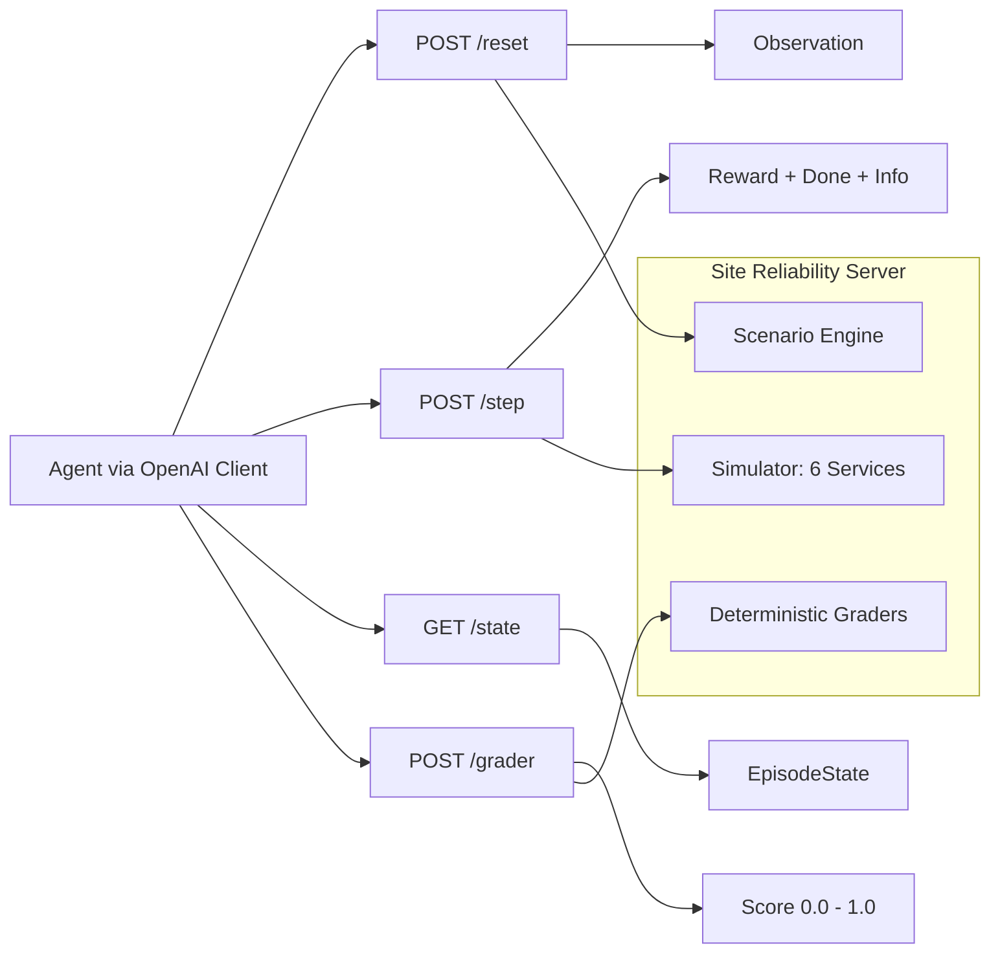
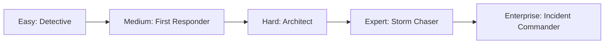
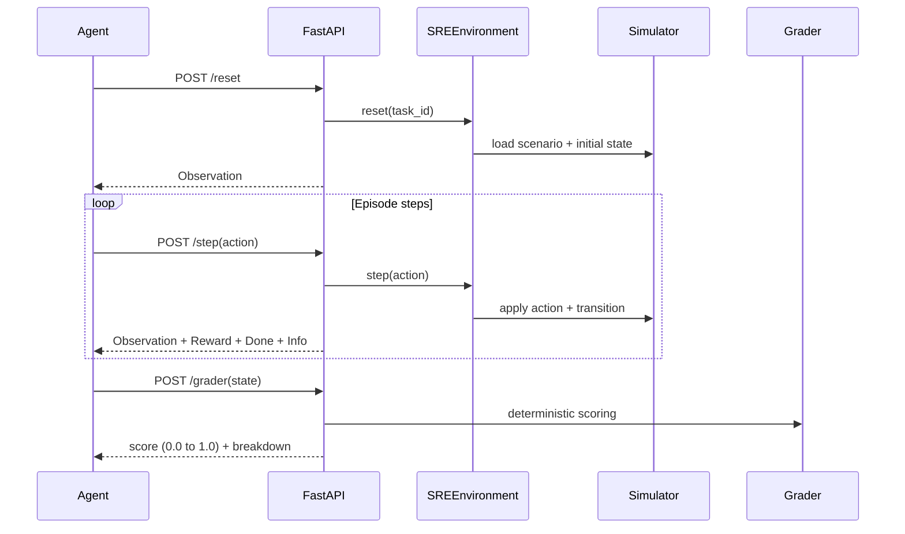

# Site Reliability Server (OpenEnv)

Production-style SRE incident-response environment for training and evaluating AI agents with the standard OpenEnv loop:
`reset()` -> `step(action)` -> `state()`.

This benchmark mirrors practical on-call operations used in real engineering teams: triaging alerts,
isolating root causes across service dependencies, and applying safe remediations under time pressure.
It is useful for evaluating whether an agent can improve reliability outcomes instead of only solving abstract tasks, aligning directly with Theme 3.1 (Professional Tasks) and Theme 1 (Multi-Agent Interactions).
The same environment also supports an optional 4-role incident command workflow (`Commander`, `Investigator`, `Remediator`, `Comms`) with strict protocol tracking, handoff coordination bonuses, and role-based action gating while remaining 100% backward compatible for single-agent RL.

## Project Highlights

- Real-world utility: production-style SRE incident diagnosis and remediation across dependent microservices.
- OpenEnv compliance: typed Observation/Action/Reward models with `reset`, `step`, `state`, and `openenv.yaml`.
- Task quality: 5 progressive tasks (`easy`, `medium`, `hard`, `expert`, `enterprise`) with deterministic programmatic graders.
- Multi-agent readiness: optional role-based ICS orchestration with protocol-aware coordination and action gating.
- Theme alignment: built for Theme 3.1 (tool-centric enterprise workflows) with optional Theme 1 multi-agent coordination.
- Learning quality: dense reward signal with progress terms and penalties for low-value behavior.
- Deployment readiness: works with Docker, Hugging Face Spaces, and OpenEnv validation.
- Infra fit: designed for `vcpu=2`, `memory=8gb`, with inference timeout bounded below 20 minutes.

## Why This Matters

- Real-world domain: incident diagnosis and remediation in microservice systems.
- Not a toy: actions have side effects, trade-offs, and partial credit.
- Benchmark value: deterministic graders with clear difficulty progression.

## Quick Start

```bash
# 1) Install
pip install -r requirements.txt

# 2) Generate scenarios
python env/data_generator.py

# 3) Set required vars
export OPENAI_API_KEY=<your_key>
export API_BASE_URL=https://api.groq.com/openai/v1
export MODEL_NAME=llama-3.1-70b-versatile
export HF_TOKEN=<your_hf_token>  # optional fallback credential

# 4) Run server
uvicorn main:app --host 0.0.0.0 --port 7860

# 5) Run baseline
python inference.py
```

## Visual Overview





## Capability Matrix

| Area | Implementation |
|---|---|
| Environment API | FastAPI with `POST /reset`, `POST /step`, `GET /state` |
| Typed models | Pydantic models for Observation, Action, Reward, EpisodeState |
| Tasks | 5 tasks with increasing difficulty and step budgets |
| Grading | Deterministic graders returning numeric `0.0-1.0` scores |
| Rewards | Dense, per-step shaping with positive progress and penalties |
| Baseline | Root-level `inference.py` using OpenAI client + env vars |
| RL Training | `train_grpo.py` (primary) and `train_ppo.py` (legacy-compatible) |
| Packaging | Dockerfile + `openenv.yaml` + local OpenEnv validation |
| Deployment | HF Space-compatible containerized runtime |

## Engineering Quality Snapshot

- Typed models and strict API contract for predictable agent interaction.
- Deterministic scenario + grader pipeline for fair task-level scoring.
- Containerized deployment that starts cleanly and serves health/reset/step/state/grader paths.
- Baseline inference pipeline with bounded runtime and machine-readable score artifacts.

## Tasks and Difficulty

| Task | Goal | Max Steps | Grader Output |
|---|---|---:|---|
| easy | Identify root-cause service | 15 | 0.0 to 1.0 |
| medium | Recover all key health metrics | 15 | 0.0 to 1.0 |
| hard | Fix hidden config regression | 20 | 0.0 to 1.0 |
| expert | Resolve multi-cause cascade | 25 | 0.0 to 1.0 |
| enterprise | Enforce incident protocol (ack -> notify -> fix -> resolve) | 25 | 0.0 to 1.0 |

### What Makes Each Task Hard

- easy: requires causal root-cause reasoning, not random restarts.
- medium: requires balancing multiple metrics, not optimizing only one.
- hard: requires config-level diagnosis from deploy/config context.
- expert: requires ordered recovery under cascading multi-service failure.
- enterprise: requires strict operational sequence across PagerDuty, Slack, and infra actions.

## Observation and Action Spaces

### Observation (typed)
- `step`, `max_steps`, `task_id`
- `metrics` (cpu, memory, error_rate, latency)
- `logs`, `deploy_history`, `current_config`
- `service_graph`, `active_alerts`, `health_summary`
- `incident_context`
- `apps_state` (enterprise app surfaces, e.g. PagerDuty/Slack)
- `protocol_status` (`is_acknowledged`, `is_team_notified`, `is_resolved`)

### Action (typed)
- `action_type`: CHECK_LOGS, INSPECT_SERVICE, DRAIN_TRAFFIC, RESTART_SERVICE, SCALE_UP, SCALE_DOWN, ROLLBACK, UPDATE_CONFIG, SILENCE_ALERT, ACKNOWLEDGE_PAGERDUTY, SEND_SLACK_MESSAGE, RESOLVE_PAGERDUTY
- `target_service`: one of six services
- `config_key`, `config_value` (for UPDATE_CONFIG)
- `incident_id`, `channel_name`, `message_text`, `params` (enterprise workflow payload)
- `reason`

### Space Summary

| Type | Core Fields | Purpose |
|---|---|---|
| Observation | metrics, logs, deploy_history, config, alerts, graph | Gives full operational context per step |
| Action | action_type, target_service, optional config edits | Encodes one remediation decision per step |
| Reward | step_reward, cumulative, breakdown | Explains why an action helped or hurt |

## Reward Design (Meaningful, Non-Sparse)

Per-step signal combines:
- health improvement (primary)
- latency improvement
- critical-service progress
- cost-awareness
- penalties for invalid/repeated low-value actions
- explicit risk penalties for disruptive behavior
- enterprise protocol penalties/bonuses (`protocol_penalty`, `protocol_progress_bonus`, `completion_bonus`)

This gives dense learning feedback instead of only end-of-episode binary success.

## API Endpoints

- `POST /reset`
- `POST /step`
- `GET /state`
- `GET /tasks`
- `POST /grader`
- `POST /baseline`
- `GET /metrics`
- `GET /health`

## Deliverables

- Hugging Face Space: [Site-Reliability-Server](https://huggingface.co/spaces/siddheshkadane/Cloud-Chaos-SRE)
- Training notebook: [Colab_Training_Pipeline.ipynb](./Colab_Training_Pipeline.ipynb)
- YouTube video: [Add your public YouTube link here](https://youtube.com)
- Medium blog: [Add your public Medium link here](https://medium.com)

## Baseline Notes

- Uses OpenAI client only.
- Reads `OPENAI_API_KEY` (preferred), `HF_TOKEN` (fallback), `API_BASE_URL`, and `MODEL_NAME` from environment.
- Runtime limit is bounded below 20 minutes (19-minute global timeout).
- Output written to `baseline_scores.json`.
- Baseline currently runs canonical scenarios for `easy`, `medium`, `hard`, `expert`, and `enterprise`.
- Reproducibility is deterministic for scenario selection and environment dynamics in evaluation mode.

## Infra Constraints

Designed for low-resource evaluation:
- `vcpu=2`, `memory=8gb`
- Pure in-memory simulation
- No external DB required

## Docker

```bash
docker build -t site-reliability-server .
docker run -p 7860:7860 site-reliability-server
curl http://localhost:7860/health
```

## Validation Commands

```bash
# HF ping
curl -s -o /dev/null -w '%{http_code}' -X POST \
  -H 'Content-Type: application/json' -d '{}' \
  https://siddheshkadane-cloud-chaos-sre.hf.space/reset

# Docker build
docker build .

# Run all local checks (pytest + openenv validate + docker + baseline)
./scripts/validate-local.sh

# Or run OpenEnv validation directly (path-safe)
.venv/bin/openenv validate

# Quick health check when server is running
curl http://127.0.0.1:7860/health
```

These checks verify tests, OpenEnv compliance, container buildability, and baseline readiness.

## RL Training

Primary RL path for current evaluation setup:

- `train_grpo.py`: GRPO trainer with Unsloth 4-bit loading and LoRA adaptation.
- `requirements_rl.txt`: RL dependencies for GRPO/TRL workflow.
- `train_ppo.py`: legacy PPO path kept for compatibility experiments.

Training scripts interact with the same local FastAPI environment via `/reset` and `/step`.

## GRPO Smoke Test (1 Epoch)

Use this quick check to verify local wiring for Unsloth + GRPO against the FastAPI environment.

```bash
# Terminal 1: activate venv and start API server
source .venv/bin/activate
python3 -m uvicorn main:app --host 0.0.0.0 --port 7860
```

```bash
# Terminal 2: activate venv and install RL stack
source .venv/bin/activate
python3 -m pip install -r requirements_rl.txt

# Optional fallback if unsloth wheel resolution fails
python3 -m pip install "unsloth[colab-new] @ git+https://github.com/unslothai/unsloth.git"

# 1-epoch smoke run (small test model for local checks)
WANDB_MODE=disabled python3 train_grpo.py --epochs 1 --max_steps 1 --model_name sshleifer/tiny-gpt2
```

Expected signal in the server logs:
- `POST /reset HTTP/1.1" 200`
- `POST /step HTTP/1.1" 200`

For actual training on A100, switch back to:
- `--model_name meta-llama/Meta-Llama-3-8B-Instruct`

## Training Evidence


## Project Structure

```text
site-reliability-server/
├── main.py, inference.py, openenv.yaml, Dockerfile, requirements.txt
├── readme.md, pyproject.toml, test_env.py
├── requirements_rl.txt, train_grpo.py, train_ppo.py
├── env/                         # core environment logic
│   ├── models.py, environment.py, simulator.py
│   ├── graders.py, tasks.py, data_generator.py
│   └── __init__.py
├── scenarios/                    # task datasets
│   ├── easy/, medium/, hard/, expert/, enterprise/
├── scripts/
│   └── validate-local.sh
├── static/                       # web landing page
│   └── index.html
└── server/                       # compatibility entrypoint
    ├── app.py
    └── __init__.py
```

### Core Runtime Flow

