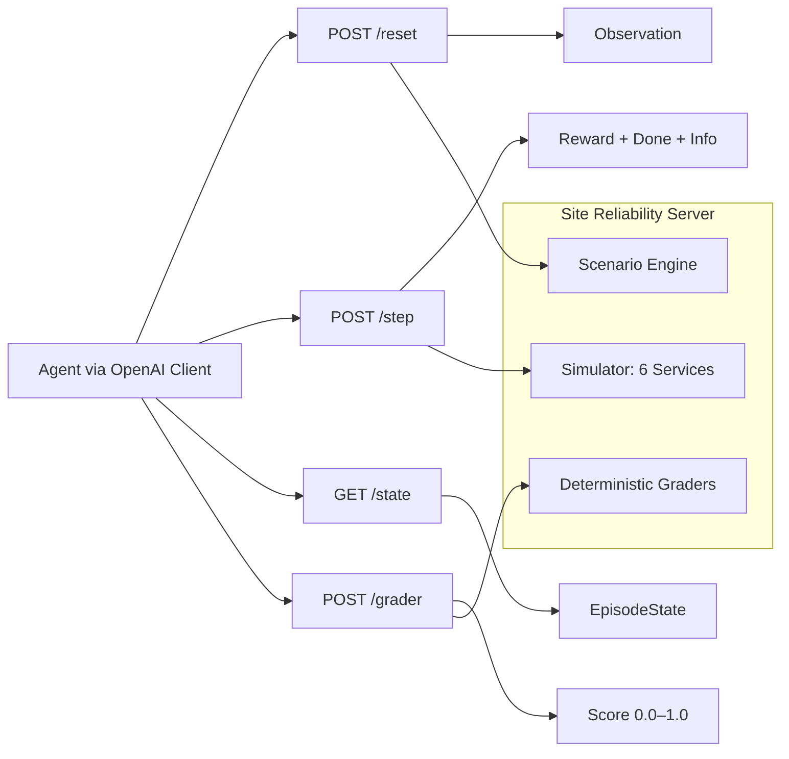
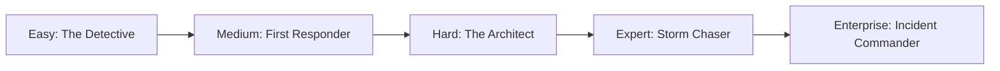
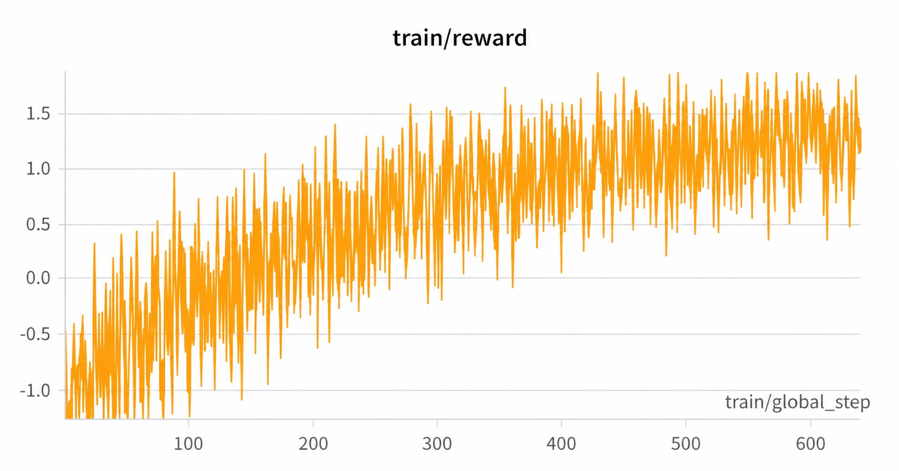
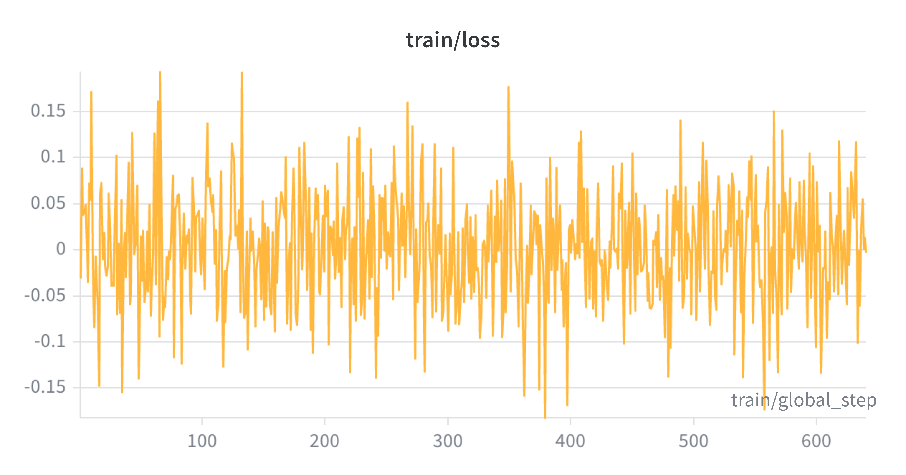

# 🏗️ Site Reliability Server — OpenEnv Benchmark

> **A production-grade SRE incident-response environment for training and evaluating AI agents.**
> Built for the Meta PyTorch × Scaler OpenEnv Hackathon — Theme 3.1: Professional Tasks.

---

## What Is This?

The **Site Reliability Server** is a deterministic OpenEnv-compatible RL environment that simulates real on-call SRE operations across a six-service microservice stack.

An agent must:
- Observe metrics, logs, alerts, configs, and deploy history
- Diagnose root causes across dependent services
- Apply safe remediations under time pressure
- Follow enterprise incident protocols (PagerDuty → Slack → fix → resolve)

This is not a toy. Actions have side effects, trade-offs, and partial credit — just like production.

---

## 🔗 Deliverables

| Resource | Link |
|---|---|
| 🤗 HF Space | [Site-Reliability-Server](https://huggingface.co/spaces/siddheshkadane/Cloud-Chaos-SRE) |
| 📓 Colab Training | [Open in Colab](https://colab.research.google.com/drive/1Hkh6BTqF7MR-xzO1AsyXmtk4vnEPa700?usp=sharing) |
| 📊 W&B Training Dashboard | [openenv-enterprise-grpo](https://wandb.ai/strungpattern-pune-institute-of-computer-technology/openenv-enterprise-grpo/runs/kpwdjvm1) |
| 📄 Evidence PDF | [Training_Evidence_Team_Powerhouse.pdf](./Training_Evidence_Team_Powerhouse.pdf) |
| 🧾 Training Output Log | [output.log](./output.log) |
| 🎥 Demo Video | [YouTube — Add link](https://youtube.com) |
| 📝 Write-up / Blog | [Medium](https://medium.com/p/7ad96bc47807?postPublishedType=initial) |

---

## ⚡ Quick Start

```bash
# 1. Install dependencies
pip install -r requirements.txt

# 2. Generate scenarios
python env/data_generator.py

# 3. Set environment variables
export OPENAI_API_KEY=<your_key>
export API_BASE_URL=https://api.groq.com/openai/v1
export MODEL_NAME=llama-3.1-70b-versatile
export HF_TOKEN=<your_hf_token>   # optional fallback

# 4. Start the server
uvicorn main:app --host 0.0.0.0 --port 7860

# 5. Run baseline
python inference.py
```

---

## 🏛️ Architecture




---

## 📋 Task Suite



| Task | Goal | Max Steps | Grader Output |
|---|---|---:|---|
| `easy` | Identify root-cause service | 15 | 0.0–1.0 |
| `medium` | Recover all key health metrics | 15 | 0.0–1.0 |
| `hard` | Fix hidden config regression | 20 | 0.0–1.0 |
| `expert` | Resolve multi-cause cascade | 25 | 0.0–1.0 |
| `enterprise` | Enforce protocol: ack → notify → fix → resolve | 25 | 0.0–1.0 |

### Why Each Task Is Hard

- **easy** — requires causal root-cause reasoning, not random restarts
- **medium** — requires balancing multiple metrics simultaneously
- **hard** — requires config-level diagnosis from deploy and config context
- **expert** — requires ordered recovery under cascading multi-service failure
- **enterprise** — requires strict operational sequence across PagerDuty, Slack, and infra actions

---

## 🔬 Observation & Action Spaces

### Observation (typed Pydantic)

| Field | Description |
|---|---|
| `step`, `max_steps`, `task_id` | Episode metadata |
| `metrics` | CPU, memory, error_rate, latency per service |
| `logs`, `deploy_history`, `current_config` | Operational context |
| `service_graph`, `active_alerts`, `health_summary` | Dependency and alert state |
| `incident_context` | Incident description and timeline |
| `apps_state` | PagerDuty / Slack surface state (enterprise) |
| `protocol_status` | `is_acknowledged`, `is_team_notified`, `is_resolved` |

### Action Space

| Field | Values |
|---|---|
| `action_type` | `CHECK_LOGS`, `INSPECT_SERVICE`, `DRAIN_TRAFFIC`, `RESTART_SERVICE`, `SCALE_UP`, `SCALE_DOWN`, `ROLLBACK`, `UPDATE_CONFIG`, `SILENCE_ALERT`, `ACKNOWLEDGE_PAGERDUTY`, `SEND_SLACK_MESSAGE`, `RESOLVE_PAGERDUTY` |
| `target_service` | `api-gateway`, `auth-service`, `user-service`, `order-service`, `db-proxy`, `cache-service` |
| `config_key`, `config_value` | For `UPDATE_CONFIG` |
| `incident_id`, `channel_name`, `message_text`, `params` | For enterprise workflow |
| `reason` | Optional rationale |

---

## 🎯 Reward Design

Dense per-step reward signal — no sparse end-of-episode binary:

| Component | Signal |
|---|---|
| Health improvement | Primary positive signal |
| Latency improvement | Secondary positive signal |
| Critical-service progress | Task-specific bonus |
| Cost-awareness | Efficiency incentive |
| Invalid/repeated action penalty | Discourages low-value behavior |
| Risk penalty | Penalizes disruptive actions |
| Protocol bonus/penalty | Enterprise sequence enforcement |
| Completion bonus | Episode success reward |

---

## 🤖 RL Training

### Setup

```bash
# Install RL dependencies
pip install -r requirements_rl.txt

# Start server (Terminal 1)
uvicorn main:app --host 0.0.0.0 --port 7860

# Run GRPO training (Terminal 2)
python train_grpo.py \
    --epochs 10 \
  --num_generations 6 \
  --per_device_train_batch_size 6 \
  --dataset_size 64 \
  --temperature 1.0 \
  --top_p 0.92 \
  --max_new_tokens 32 \
  --max_prompt_length 512 \
    --model_name Qwen/Qwen2.5-Coder-3B-Instruct \
    --env_url http://localhost:7860 \
    --output_dir ./artifacts/grpo-run
```

Important: `train_grpo.py` enforces `num_generations >= 2` and requires
`per_device_train_batch_size % num_generations == 0`.

### Smoke Test (1 epoch, tiny model)

```bash
WANDB_MODE=disabled python train_grpo.py \
    --epochs 1 --max_steps 1 \
    --model_name sshleifer/tiny-gpt2
```

Expected server logs: `POST /reset 200` and `POST /step 200`.

### Training Stack

| Component | Choice |
|---|---|
| Algorithm | GRPO (Group Relative Policy Optimization) |
| Trainer | TRL `GRPOTrainer` (v0.18.2) |
| Model | `Qwen/Qwen2.5-Coder-3B-Instruct` (4-bit NF4 via bitsandbytes) |
| Adapter | LoRA (r=16, α=32) via PEFT |
| Reward functions | Environment reward + format validity + action validity + protocol adherence |
| Logging | Weights & Biases |

---

## 📈 Training Evidence

Full interactive charts (reward, loss, KL, entropy, invalid action rate):

**[→ W&B Run Dashboard](https://wandb.ai/strungpattern-pune-institute-of-computer-technology/openenv-enterprise-grpo/runs/kpwdjvm1)**





---

## 🌐 API Reference

| Endpoint | Method | Purpose |
|---|---|---|
| `/reset` | POST | Start new episode, returns initial observation |
| `/step` | POST | Submit action, returns observation + reward + done |
| `/state` | GET | Get current episode state |
| `/grader` | POST | Score final episode (0.0–1.0) |
| `/tasks` | GET | List available tasks |
| `/baseline` | POST | Run scripted baseline policy |
| `/metrics` | GET | Current environment metrics |
| `/health` | GET | Server health check |

---

## ✅ Capability Matrix

| Area | Implementation |
|---|---|
| Environment API | FastAPI: `POST /reset`, `POST /step`, `GET /state` |
| Typed models | Pydantic: Observation, Action, Reward, EpisodeState |
| OpenEnv compliance | `SREEnvironment` inherits `openenv.env.Env` with `openenv.yaml` |
| Tasks | 5 tasks with progressive difficulty and deterministic graders |
| Rewards | Dense per-step shaping with progress terms and penalties |
| Multi-agent | Optional ICS 4-role orchestration (Commander, Investigator, Remediator, Comms) |
| Baseline | `inference.py` with OpenAI client, bounded 19-minute runtime |
| RL Training | `train_grpo.py` — GRPO + TRL + bitsandbytes 4-bit |
| Packaging | Dockerfile + `openenv.yaml` + OpenEnv validation passing |
| Deployment | HF Space-compatible containerized runtime |

---

## 🐳 Docker

```bash
docker build -t site-reliability-server .
docker run -p 7860:7860 site-reliability-server
curl http://localhost:7860/health
```

---

## 🔍 Validation

```bash
# HF Space ping
curl -s -o /dev/null -w '%{http_code}' -X POST \
  -H 'Content-Type: application/json' -d '{}' \
  https://siddheshkadane-cloud-chaos-sre.hf.space/reset

# Full local validation (tests + OpenEnv contract + Docker + baseline)
./scripts/validate-local.sh

# OpenEnv contract validator only
.venv/bin/python scripts/validate_openenv_contract.py

# Health check
curl http://127.0.0.1:7860/health
```

> Note: `validate-local.sh` requires (`OPENAI_API_KEY` or `HF_TOKEN`) plus `API_BASE_URL` and `MODEL_NAME`.

---

## 📦 Baseline Notes

- Uses OpenAI client only — no custom inference stack required
- Reads `OPENAI_API_KEY` (preferred) or `HF_TOKEN` (fallback) from environment
- Runtime bounded below 20 minutes (19-minute global timeout)
- Output written to `baseline_scores.json`
- Runs canonical scenarios for all 5 tasks: `easy`, `medium`, `hard`, `expert`, `enterprise`
- Deterministic for scenario selection and environment dynamics in evaluation mode

---

## 📊 Latest Verified Results

- Baseline run from [baseline_scores.json](./baseline_scores.json):
  - mean_score: `0.944`
  - task scores: `easy 0.9989`, `medium 0.9059`, `hard 0.8969`, `expert 0.9744`
- Honest random-policy stress check (live API rollout, unseen seeds):
  - single-agent (`expert-002`): `grader_score 0.4804`, `invalid_actions 9`, `steps 25`
  - multi-agent enterprise (`enterprise-008`): `grader_score 0.6507`, `invalid_actions 20`, `steps 25`

Interpretation: the environment is strict and does not inflate scores for random behavior; strong scores require protocol-correct and targeted policies.

---

## 🗂️ Project Structure

```text
site-reliability-server/
├── main.py                        # FastAPI server
├── inference.py                   # Baseline inference pipeline
├── train_grpo.py                  # GRPO RL training script
├── openenv.yaml                   # OpenEnv manifest
├── Dockerfile                     # Container definition
├── requirements.txt               # Server dependencies
├── requirements_rl.txt            # RL training dependencies
├── Colab_Training_Pipeline.ipynb  # Google Colab training notebook
├── README.md
├── env/
│   ├── environment.py             # SREEnvironment: reset/step/state/grade
│   ├── simulator.py               # VirtualDataCentre: 6-service simulation
│   ├── models.py                  # Pydantic typed models
│   ├── graders.py                 # Deterministic task graders
│   ├── tasks.py                   # Task definitions
│   ├── data_generator.py          # Synthetic scenario generator
│   └── __init__.py
├── scenarios/
│   ├── easy/, medium/, hard/, expert/, enterprise/
├── scripts/
│   ├── validate-local.sh
│   └── validate_openenv_contract.py
├── static/
│   └── index.html                 # Web landing page
└── server/
    ├── app.py                     # Compatibility entrypoint
    └── __init__.py
```

